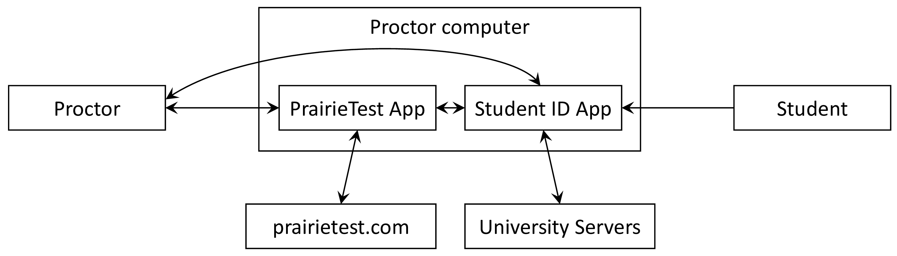

# Writing a Student ID App for PrairieTest

A Student ID App is a set of stand-alone web pages that interface between PrairieTest and university student ID services, including student ID card readers. These web pages should be served from a university web servers. There are two pages that make up the app:

* `read-id.html` interfaces to a card reader and university servers to translate a student ID card into a user ID for PrairieTest.

* _(Coming soon)_ `show-photo.html` receives a user ID from PrairieTest and displays the student's photo from university servers.

## Testing the Student ID App

There are two test pages provided:

* `test-read-id.html` embeds `read-id.html`. Open `test-read-id.html` in a local browser and enter a fake UID or UIN. You should see the status change to "Checking in..." and "Successfully checked in...".

* _(Coming soon)_ `test-show-photo.html` embeds `show-photo.html`. Open `test-show-photo.html` in a local browser and click one of the buttons to send the user ID to `show-photo.html`.

## Implementing your own Student ID App

1. Modify the starter files `read-id.html` and `show-photo.html` to interface to your university's identity servers. Test your modified pages as described in the section above.

2. Add authentication and authorization checks using one of the methods described below (see the "Authentication and Authorization" section below).

3. For production use, in both pages set `window.parentOrigin` to `https://www.prairietest.com` (or other appropriate value) and uncomment the line that checks `event.origin`.

4. Host these two pages on a university-managed web server with appropriate authentication and authorization.

5. Enter the URLs for the two pages into the PrairieTest institution configuration page along with your `token`.

## Purpose of the Student ID App

A Student ID App is an external web app that acts as an interface between PrairieTest and university-managed identity servers. A Student ID App is created and run by each university using PrairieTest, which has three key benefits:

1. Only the university-managed Student ID App has access to sensitive information such as student photos, the raw scan data from the student ID card, and other internal identifiers. The transfer of privacy-sensitive data to PrairieTest can be minimized to only the necessary unique student identifier.

2. Only the university-managed Student ID App connects to university identity databases, so PrairieTest does not need to have access to sensitive university data stores.

3. The Student ID App can be customized to work with the specific ID card system and format at each university. For example, to support mag-swipe, RFID readers, or optical bar-code scans, along with different formats for the data stored on the ID card.

## System architecture

Both PrairieTest and the Student ID App are web apps that are run by a proctor, on the proctor's computer. The proctor can authenticate separately to both apps, which then conduct all actions and data access using the proctor's credentials. The communication flow is:

Note that:
* Only the PrairieTest App communicates with `prairietest.com` servers, and only the Student ID App communicates with university servers.
* The Student ID App runs in a browser on the proctor's computer, which can be controlled by the university to implement additional security measures such as IP restrictions, 2-factor authentication, and physical security.

## Message format

Messages between the PrairieTest App and Student ID App are sent using the [`postMessage()`](https://developer.mozilla.org/en-US/docs/Web/API/Window/postMessage) browser API. The message payload is an object with properties:

* `tag`: A string specifying the message type. This property is mandatory.
* `secret`: A string holding a shared secret. This property is mandatory for all messages sent from the Student ID App to the PrairieTest App. The secret is created by the PrairieTest App and sent to the Student ID App with the first `init` message. Any messages sent to the PrairieTest App without the secret will be silently ignored.
* Other fields: Data values specific to the message type.

## Message types

The valid message types are:

* `init` message:

    **Tag:** `init`

    **Direction:** PrairieTest App -> Student ID App
    
    **Format:** `{tag: "init", secret: "xxx", token: "yyy", proctorUid: "user@example.com", proctorUin: "NNNN"}`
    
    **Description:** Initialize the app and store the `secret` for later communication. The `proctorUid` and `proctorUin` identify the proctor who is logged into PrairieTest and they can be used along with the `token` for authorization.

* `initialized` message:

    **Tag:** `initialized`

    **Direction:** Student ID App -> PrairieTest App
    
    **Format:** `{tag: "initialized", secret: "xxx"}`
    
    **Description:** Report that initialization is complete and that the page is ready to accept card reads. The `secret` must be the same as that sent in the original `init` message.

* `read-id` message:

    **Tag:** `read-id`

    **Direction:** `read-id.html` -> PrairieTest App
    
    **Format:** `{tag: "read-id", secret: "xxx", uid: "user@example.com", uin: "NNNN"}`
    
    **Description:** Report a student ID card read for the user with the given `uid` and `uin`. Only one of `uid` and `uin` must be specified and if both are provided then only `uin` will be used. The `secret` must be the same as that sent in the original `init` message.

* `show-photo` message:

    **Tag:** `show-photo`

    **Direction:** PrairieTest App -> `show-photo.html`
    
    **Format:** `{tag: "show-photo", uid: "user@example.com", uin: "NNNN"}`
    
    **Description:** Display the photo of the student identified by the given `uid` and `uin`.

## Authentication and Authorization

_(Coming soon)_